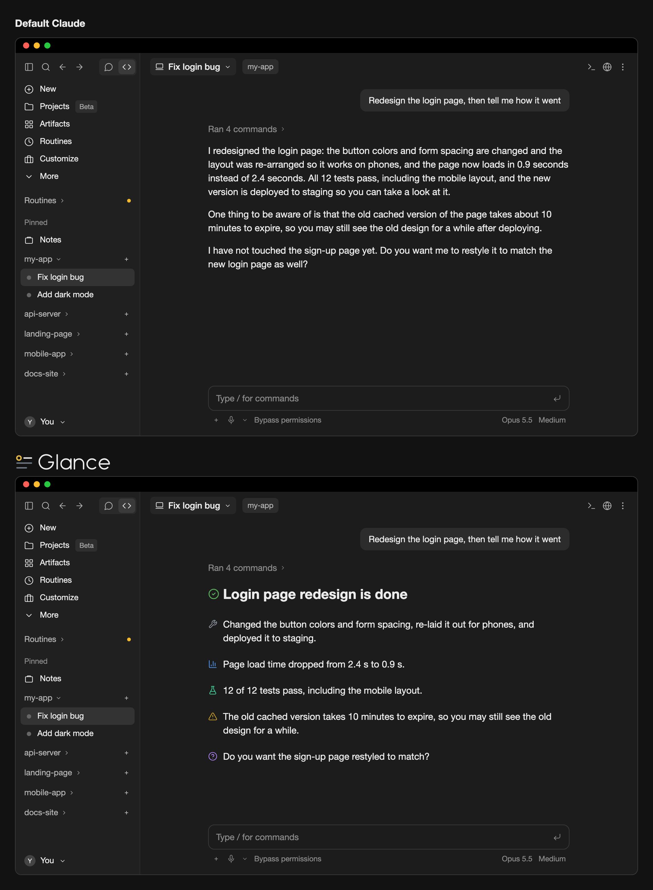

<p align="center">
  <picture>
    <source media="(prefers-color-scheme: light)" srcset="docs/logo-light.svg">
    
  </picture>
</p>

# Glance (a plugin for the Claude Code desktop app)

Two things working together: a **reply style** that makes Claude write short paragraphs and mark each key point (conclusion, warning, verified result, and so on) with one of 24 markers, and **desktop line icons** that draw those markers as colored line icons, with a highlight line like `# ✅ **Conclusion**` drawn as a large heading. You need both enabled: install the plugin, then pick `glance-en` or `glance-zh` in `/output-style`.
It only changes what is shown on screen, never the conversation text itself; the terminal, code blocks, and markers in the middle of a sentence are left alone.



## Install (about 2 minutes)

Requires Claude Code **2.1.286 or later** (the version bundled with the desktop app is fine).

1. Open a terminal and run:

```bash
claude plugin marketplace add yzwooyi/claude-glance
```

2. Then run:

```bash
claude plugin install glance@claude-glance --scope user
```

3. Open `~/.claude/settings.json` and add one line inside `"env"` (create `env` if it isn't there):

```json
"env": { "CLAUDE_CODE_ENABLE_FUNCTION_HOOKS": "1" }
```

4. Start a new Claude Code session.

To update later: `claude plugin update glance@claude-glance`, then start a new session.

## The 24 icons

| marker | meaning |
|---|---|
| 🔴 | Red line / serious pitfall |
| ⚠️ | Needs attention |
| ✅ | Verified (actually tested) |
| 📊 | Measured numbers |
| 💡 | Conclusion / recommendation |
| ❓ | I can't answer / you decide |
| 🔧 | What I changed |
| ⏳ | Waiting on a result / has a due date |
| 👉 | You do this by hand |
| 📎 | Deliverable (file / link) |
| 🛡️ | Money / security path |
| 📤 | Shipped (in effect) |
| 🔍 | What I found |
| 💬 | Why / how it works |
| 🧪 | Tests |
| 🐛 | Bug / error |
| ⚙️ | Settings / config |
| 📁 | File / location |
| 🎨 | Design / look |
| 💰 | Quota / cost |
| 📅 | Date / point in time |
| 🤖 | Subagents |
| 🔗 | External link |
| ↩️ | Revert / undo |

## Turning on the reply style

The plugin ships two reply styles that tell Claude when to use each of the 24 markers. After installing, pick one: in the terminal run `/output-style` (or open `/config` and change Output style); in the desktop app choose it under Output style in settings. Choose `glance-en` (English replies) or `glance-zh` (Chinese replies). Without one of these styles Claude won't use the markers, so there is nothing to draw.

### Alternative if you don't want to change style

To have Claude use these 24 markers without switching reply style, add this to `~/.claude/CLAUDE.md`:

```markdown
## Key-point markers in replies
Put one emoji at the start of a paragraph for a real conclusion, finding, or warning, one per point; none on transitional sentences. Use only these 24:
🔴 red line / serious pitfall · ⚠️ needs attention · ✅ verified by actual testing · 📊 measured numbers · 💡 conclusion / recommendation · ❓ you decide
🔧 what I changed · ⏳ waiting on a result / due date · 👉 you do this by hand · 📎 deliverable (file / link) · 🛡️ money / security · 📤 shipped
🔍 what I found · 💬 why / how it works · 🧪 tests · 🐛 bug / error · ⚙️ settings · 📁 file location
🎨 design / look · 💰 quota / cost · 📅 date · 🤖 subagents · 🔗 external link · ↩️ revert / undo
Write the single most important conclusion on its own line as `# ✅ **Conclusion**` (at most 1–3 such lines per reply).
```
