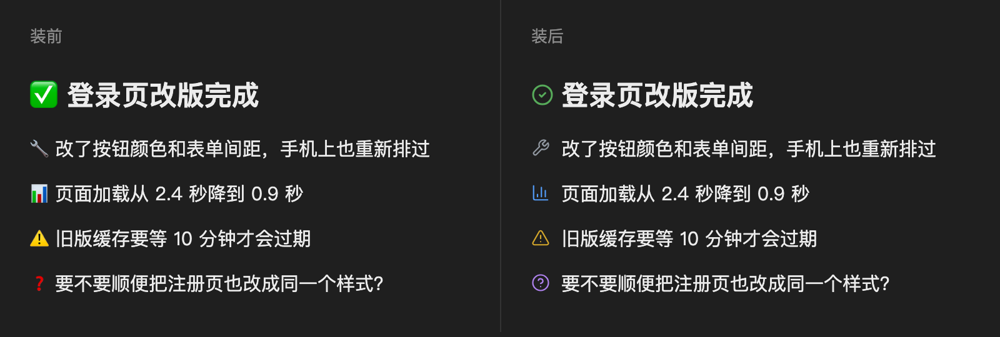

# emoji-icons（Claude Code 桌面版 mod）

把 Claude 回复里**段落开头**的 24 个标记 emoji 换成统一的细线图标；`# ✅ **结论**` 这种重点行画成大字。
只改屏幕显示，不改对话原文；终端、代码块、句子中间的 emoji 都不动。



## 安装（约 2 分钟）

需要 Claude Code **2.1.286 或以上**（桌面版自带的就行）。

1. 打开终端，运行：

```bash
claude plugin marketplace add yzwooyi/claude-emoji-icons
```

2. 再运行：

```bash
claude plugin install emoji-icons@jazper-share --scope user
```

3. 打开 `~/.claude/settings.json`，在 `"env"` 里加一行（没有 `env` 就新建）：

```json
"env": { "CLAUDE_CODE_ENABLE_FUNCTION_HOOKS": "1" }
```

4. 新开一个 Claude Code 会话。

以后更新：`claude plugin update emoji-icons@jazper-share`，再开新会话。

## 让 Claude 用这些 emoji

mod 只负责「换图标」，Claude 平时不会主动在段首用这些 emoji。插件已自带两个配合的回复风格，装好后在 Claude Code 里选用：终端里打开 `/config`，改 Output style；桌面版在设置里的输出风格里选。选 `emoji-icons-zh`（中文）或 `emoji-icons-en`（英文）即可。

### 不想换风格时的备选

只想让 Claude 用这 24 个 emoji、不换回复风格的话，把下面这段加进 `~/.claude/CLAUDE.md`：

```markdown
## 回复里的重点标记
真正的结论、发现、警告前面挂一个 emoji（放在段首），一个重点一个；过渡句不挂。只用这 24 个：
🔴 红线/严重坑 · ⚠️ 需要注意 · ✅ 实测验证过 · 📊 量出来的数字 · 💡 结论/建议 · ❓ 要你定
🔧 我改了什么 · ⏳ 等结果/到期日 · 👉 要你亲手做 · 📎 交付物（文件/链接） · 🛡️ 钱/安全相关 · 📤 已上线
🔍 查到的发现 · 💬 为什么/原理 · 🧪 测试 · 🐛 bug/报错 · ⚙️ 设置 · 📁 文件位置
🎨 设计/外观 · 💰 额度/花费 · 📅 日期 · 🤖 子代理 · 🔗 外部链接 · ↩️ 退回/撤销
最重要的一句结论单独一行写成 `# ✅ **结论**`（每条回复最多 1–3 行）。
```
